# 🌧️ Rain Prediction in Australia: Machine Learning Classification

## 📌 Project Overview
This project applies machine learning classification algorithms to predict whether it will rain tomorrow in various locations across Australia. By analyzing historical weather data, we built and compared multiple models to find the most accurate predictor.

## 📊 Exploratory Data Analysis (EDA)
We explored the relationships between numerical features to understand dependencies and avoid multicollinearity. 
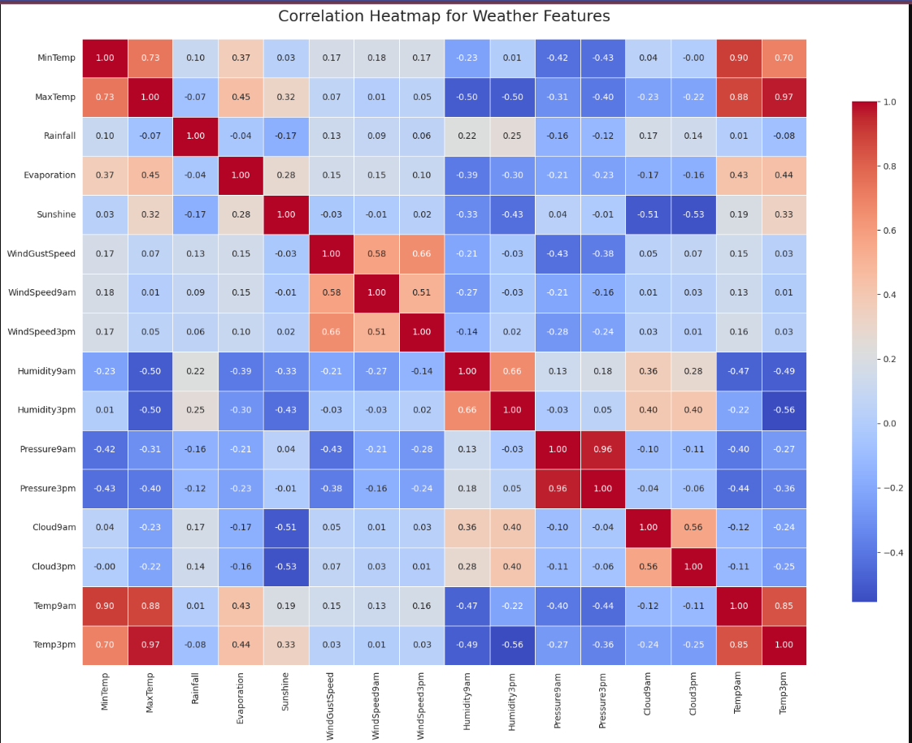

To better understand the distributions and detect outliers in our continuous variables, we visualized the numerical features:

**Feature Distributions (Histograms):**
Visualizing the distributions of features like Rainfall, Evaporation, and Wind Speeds reveals right-skewed patterns.
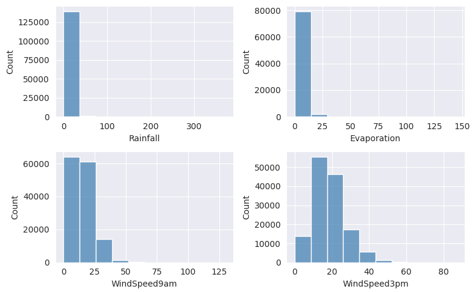

**Outlier Detection (Boxplots):**
Boxplots highlight the presence of extreme values in our weather data that require specific handling before modeling.
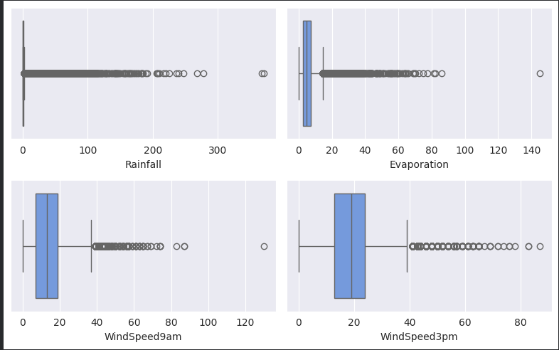

## 🛠️ Data Preprocessing & Feature Engineering

To enhance model reliability and ensure a robust evaluation process, a comprehensive preprocessing pipeline was developed. The following steps were applied:

* **Outlier Detection & Treatment:**  
  Extreme weather values were handled using a **capping (winsorization) approach** rather than removal, preserving valuable information while reducing the impact of potential anomalies.

* **Missing Data Handling:**  
  Missing values were carefully processed through separate imputation strategies for **numerical and categorical features**, maintaining data consistency and preventing information loss.

* **Feature Scaling & Normalization:**  
  Numerical features were standardized using **StandardScaler** to achieve comparable feature distributions and improve the performance of distance-based and gradient-based machine learning algorithms.

* **Data Splitting Strategy:**  
  The dataset was divided into training and testing sets using an **80/20 split ratio**, ensuring an unbiased evaluation of the model's generalization capability on unseen weather data.

## 🤖 Models Trained
We experimented with four different classification models to establish the best decision boundary:
1. **Logistic Regression** 
2. **Decision Tree** 
3. **Random Forest** 
4. **Gaussian Naive Bayes**

## 📈 Results & Best Model Performance
*(Here is the performance summary of our trained models on the unseen test set)*

| Model | Accuracy |
| :--- | :---: |
| **Random Forest** | **85%** |
| Logistic Regression | 84% |
| Decision Tree | 78% |
| Naive Bayes | 65% |

*(Note: Accuracy percentages in the table can be manually updated in this README to reflect the exact decimals from the notebook).*

### Best Model Performance (Random Forest)
Below is the Confusion Matrix and ROC Curve for our top-performing model:

**Confusion Matrix:**
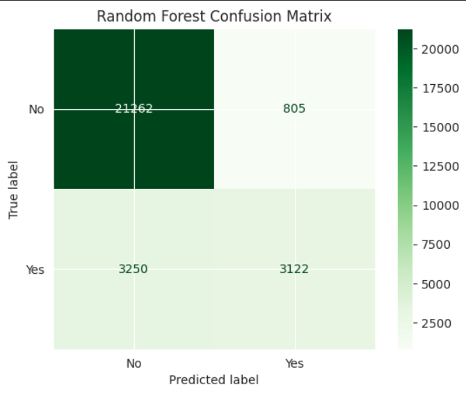

**ROC Curve:**
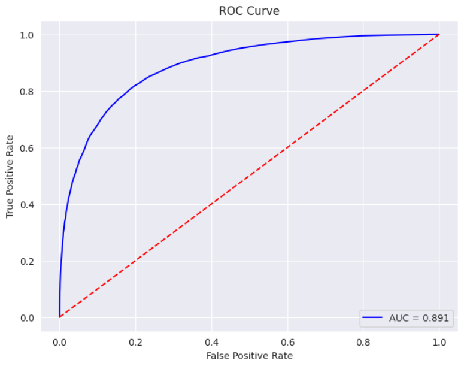

---
### Performance of Other Evaluated Models

#### Logistic Regression (Threshold = 0.35)
**Confusion Matrix:**
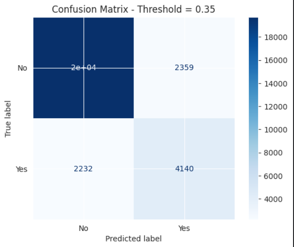

**ROC Curve (AUC = 0.873):**
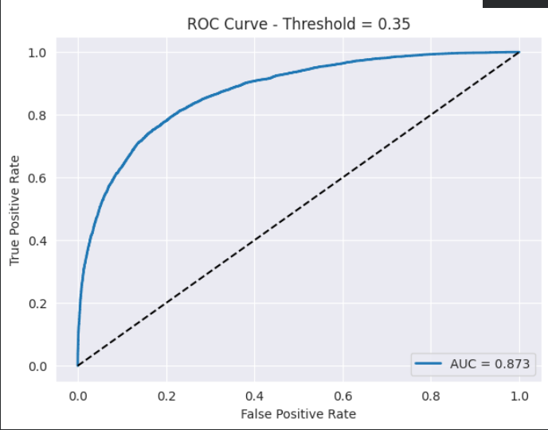

#### Decision Tree
**Confusion Matrix:**
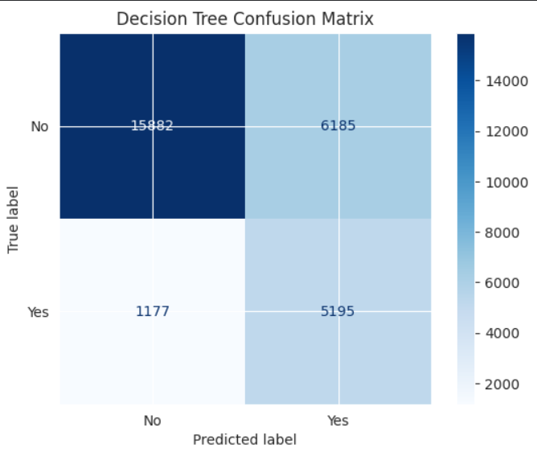

**ROC Curve (AUC = 0.844):**
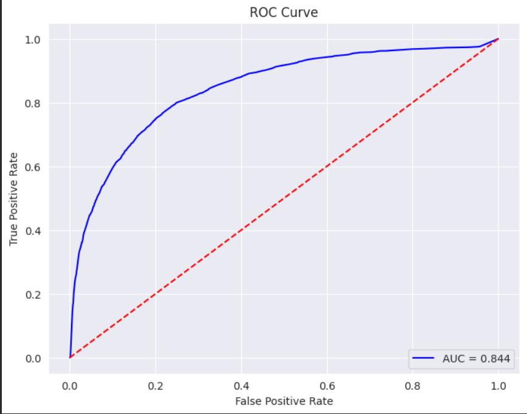

#### Gaussian Naive Bayes
**Confusion Matrix:**
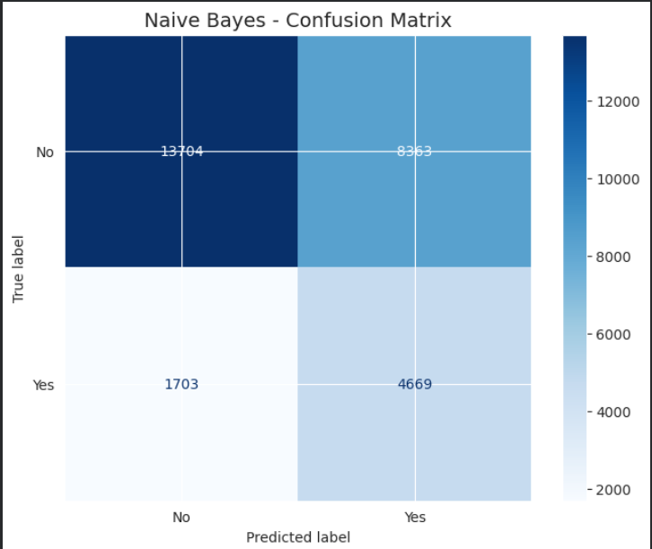

**ROC Curve (AUC = 0.75):**
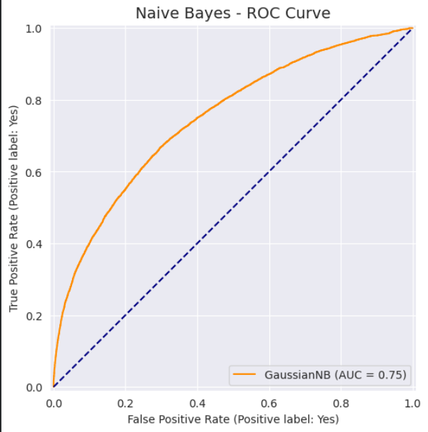

### 🧠 Model Insights & Performance Analysis
Understanding *why* each model performed the way it did is crucial for this project. Here is our technical breakdown of the results:

1. **Random Forest (85% - Best Performer):**  
   Achieved the highest accuracy and AUC because weather data is highly non-linear and complex. As an ensemble method, it successfully captured these non-linear relationships without overfitting, and it naturally handled the multicollinearity present in our features (as seen in the EDA heatmap).

2. **Logistic Regression (84% - Close Second):**  
   Performed exceptionally well due to our rigorous preprocessing pipeline. The application of **Log Transforms** (for skewed data like Rainfall), **Capping** (for extreme outliers), and **MinMaxScaler** created an ideal environment for this linear model. The built-in L2 Regularization successfully mitigated the negative effects of multicollinearity.

3. **Decision Tree (78% - Moderate):**  
   While it provided good baseline splits and handled outliers well, a single decision tree is prone to high variance and can struggle to generalize perfectly on unseen data compared to an ensemble of 100 trees (Random Forest).

4. **Gaussian Naive Bayes (65% - Underperformed):**  
   As expected, this was the weakest model. Naive Bayes relies on the strong assumption of **feature independence**. Our correlation heatmap clearly showed that many weather features (e.g., Temp9am and Temp3pm, Pressure9am and Pressure3pm) are highly correlated. The violation of this independence assumption caused the model's accuracy to drop significantly.

## 👥 Team Members

* **Youssef Mahmoud** - [LinkedIn Profile](https://www.linkedin.com/in/youssef-mahmoud-3a633225b/)
* **[Mohamed Nasser]** - [LinkedIn Profile](https://www.linkedin.com/in/mohamed-nasser-563059319/)
* **[Name of the third member]** - [LinkedIn Profile](حط لينك LinkedIn هنا)
* **[Name of the fourth member]** - [LinkedIn Profile](حط لينك LinkedIn هنا)
